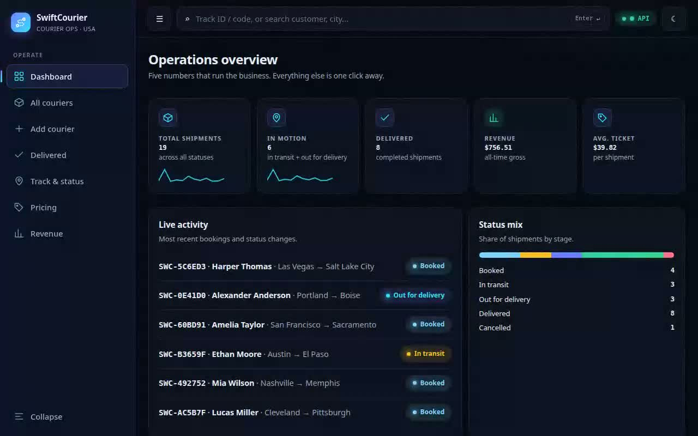
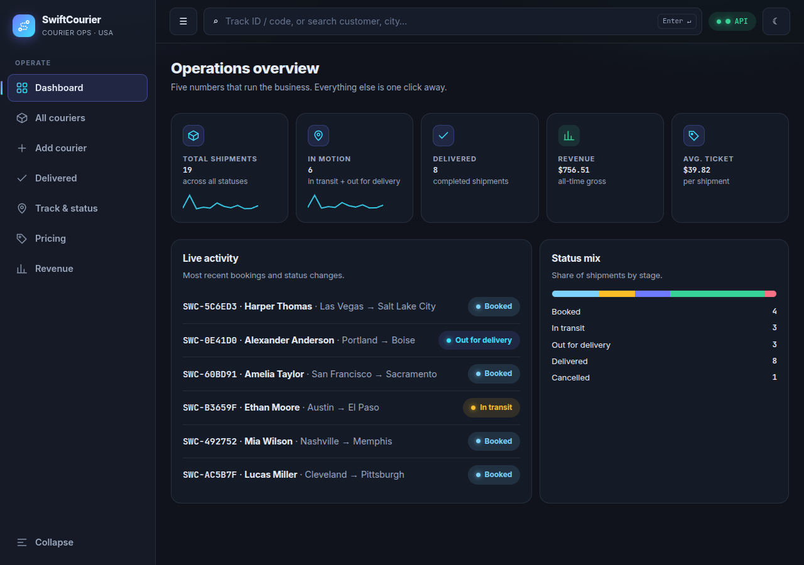
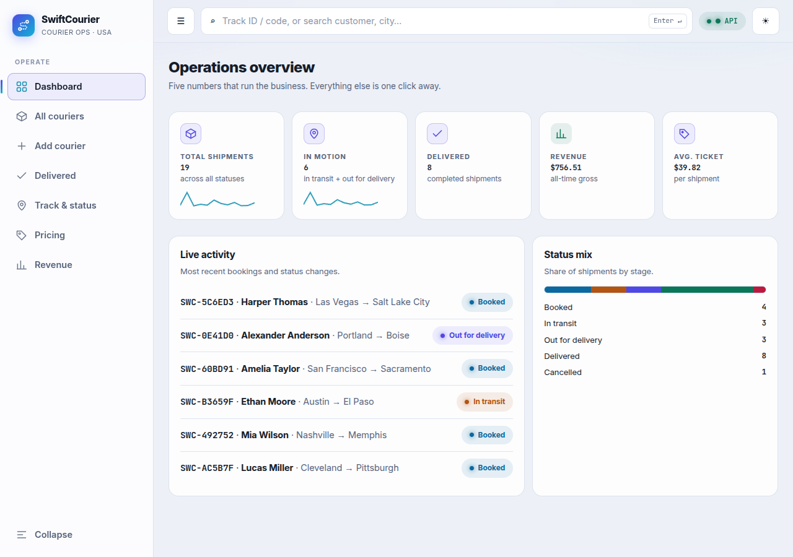
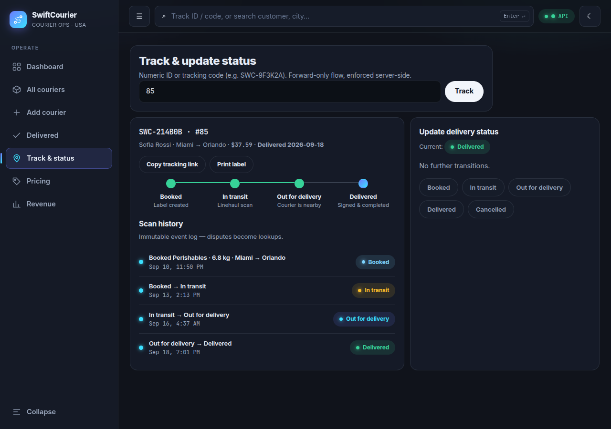
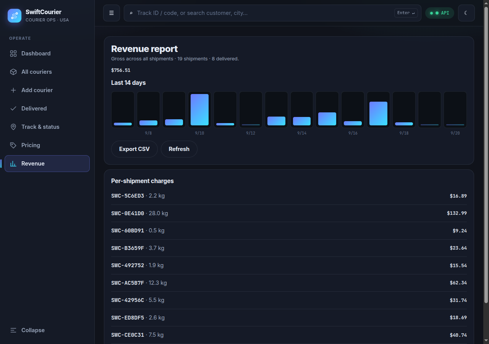
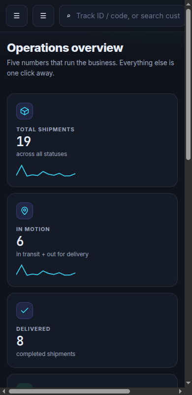

# SwiftCourier — Courier Management System

> Production full-stack courier SaaS: FastAPI + PostgreSQL + Redis backend, React + Vite dashboard, one-command Docker Compose. Book, track, price, and report on shipments with server-enforced state machines and immutable scan history.

[](../../actions)
[](LICENSE)
[](#-why-this-stack)
[](#-quick-start-30-seconds)
[](#-demo)

**Live demo:** run it locally in 30 seconds — [Quick Start](#-quick-start-30-seconds) · **API docs:** `http://localhost:8001/docs` (or `http://localhost:8081/docs` via proxy) · **Health:** `GET /api/health`

## 🎬 Demo

15-second tour recorded live via Playwright (dashboard → couriers → booking → tracking → pricing → revenue). GIF autoplays everywhere; MP4 has full quality.


<details>
<summary>▶ Watch full-quality MP4 + poster (click to expand)</summary>

[](docs/demo.mp4)

* [`docs/demo.mp4`](docs/demo.mp4) — 15 s, 1280×800 H.264, ~1.2 MB, narrates the same tour with full fidelity
* [`docs/demo.gif`](docs/demo.gif) — 720 px, 12 fps, ~5.0 MB, inline autoplay for GitHub / npm / mobile
* Regenerate anytime: [`docs/DEMO.md`](docs/DEMO.md) (Playwright `recordVideo` + `ffmpeg` palette workflow)

</details>

> **Publishing tip (verified 2026 pattern):** after pushing to GitHub, drag `docs/demo.mp4` into any issue comment — GitHub hosts it on `user-images.githubusercontent.com` with a native player. Replace the `docs/demo.mp4` link above with that CDN URL for inline playback on github.com while keeping the GIF as offline fallback.

## ✨ Screenshots (all from live API data, 2026-09-20)

| Dashboard (dark, default) | Dashboard (light) |
|---|---|
|  |  |

| Tracking stepper + scan history | Revenue report | Mobile (drawer + vertical timeline) |
|---|---|---|
|  |  |  |

## 📑 Table of Contents

- [Demo](#-demo)
- [Features](#-features)
- [Quick Start (30 seconds)](#-quick-start-30-seconds)
- [Demo data](#-demo-data-one-command)
- [Usage](#-usage)
- [Configuration](#️-configuration)
- [API reference](#-api-reference)
- [Why this stack](#-why-this-stack)
- [Project structure](#️-project-structure)
- [Testing](#-testing-36-automated-checks-one-command)
- [Design system](#-design-system--swiftcourier-noir)
- [Roadmap](#️-roadmap-honestly-deferred)
- [Contributing](#-contributing)
- [License](#-license)
- [Acknowledgments + research votes](#-acknowledgments--research-votes)

## ✨ Features

| # | Classroom feature | What it is now | API | UI |
|---|---|---|---|---|
| 1 | Add courier | Validated booking + server-side pricing + live preview | `POST /api/couriers` | Add courier form |
| 2 | View all | Searchable table + status chips + CSV export | `GET /api/couriers` | All couriers |
| 3 | Search | ID + case-insensitive tracking-code + fuzzy `?q=` | `GET /api/couriers/{id}`, `/by-tracking/{code}` | Top search bar / Track & status |
| 4 | Update status | Forward-only state machine, `409` on illegal jumps | `PATCH /api/couriers/{id}/status` | Stepper + timeline + advance |
| 5 | Charges | Transparent `$6.99 + $4.50/kg`, env-tunable | `GET /api/couriers/charges/preview?weight_kg=` | Pricing calculator |
| 6 | Delivered view | Filtered list, same table | `GET /api/couriers/delivered` | Delivered |
| 7 | Delete | Removes courier + events, `204` | `DELETE /api/couriers/{id}` | Row action (confirm) |
| 8 | Revenue | Gross + counts + dashboard KPIs | `GET /api/revenue`, `GET /api/stats` | Dashboard + Revenue report |
| 9 | Exit | No dead-ends | — | Sidebar navigation |
| + | Scan history | Immutable audit trail, never mutated | `GET /api/couriers/{id}/events` | Timestamped scan log |
| + | ETAs | Deterministic, server-computed, labeled Estimated | `eta_date`, `eta_label` on every courier | Tracking header |
| + | Deep links | Every shipment addressable | `?track=<id>` | Copy tracking link |
| + | Labels | Print-only shipping label | — | Print label (`window.print`) |

Business rules (server-enforced): `booked → in_transit → out_for_delivery → delivered` (`cancelled` anytime before delivered, **409** on illegal jumps), Pydantic validation on every payload (**422** on bad input), shared Redis rate limiting (**120/min/IP, 429 + Retry-After**), request-ID + security headers on every response.

## 🚀 Quick Start (30 seconds)

Prerequisites: Docker + Compose v2.

```bash
cp .env.example .env        # adjust passwords/ports
docker compose up -d --build
```

| Entry | URL |
|---|---|
| App (dashboard) | http://localhost:8081/ (or `$APP_PORT`) |
| API direct (Swagger) | http://localhost:8001/docs (or `$API_PORT`) |
| API via app proxy | http://localhost:8081/docs |
| Health | `GET /api/health` → `{"status":"ok",...}` |
| Readiness | `GET /api/ready` → `200` / `503` |

> Host already uses 8000/8080? This repo ships `.env` with `APP_PORT=8081`, `API_PORT=8001`.

## 📦 Demo data (one command)

```bash
docker compose exec backend python -m app.seed_demo --yes
```

Seeds a curated 14-day universe: **19 shipments, $756.51 revenue** (8 delivered · 3 in transit · 3 out for delivery · 4 booked · 1 cancelled), realistic US customers/routes/parcels, full timestamped scan-event histories. `--yes` is required because it wipes demo couriers + events. Fictional 555-01XX phones throughout. Tests are unaffected (isolated SQLite file).

## 🔧 Usage

**Book a 2 kg parcel (→ `$15.99`):**

```bash
curl -s -X POST http://localhost:8001/api/couriers \
  -H 'Content-Type: application/json' \
  -d '{"customer_name":"Alex Morgan","phone":"+15550102030","parcel_type":"Documents","weight_kg":2,"source":"Austin","destination":"Denver"}'
```

**Price preview (→ `$24.99` for 4 kg):**

```bash
curl -s 'http://localhost:8001/api/couriers/charges/preview?weight_kg=4'
# {"weight_kg":4,"base_fee_usd":6.99,"rate_per_kg_usd":4.5,"total_usd":24.99,"currency":"USD"}
```

**Advance forward (legal) vs jump (409):**

```bash
curl -s -X PATCH http://localhost:8001/api/couriers/1/status \
  -H 'Content-Type: application/json' -d '{"status":"in_transit"}'   # 200
curl -s -X PATCH http://localhost:8001/api/couriers/1/status \
  -H 'Content-Type: application/json' -d '{"status":"delivered"}'    # 409 Illegal transition
```

**Track by code (case-insensitive) + history + revenue:**

```bash
curl -s http://localhost:8001/api/couriers/by-tracking/swc-abc123
curl -s http://localhost:8001/api/couriers/1/events
curl -s http://localhost:8001/api/revenue
```

Top-bar search in the UI routes `ID` / `SWC-…` to tracking, plain words to table filter. Every shipment is deep-linkable: `/ ?track=<id>`.

## ⚙️ Configuration

| Var | Default (`.env.example`) | Local `.env` | Meaning |
|---|---|---|---|
| `POSTGRES_USER` / `PASSWORD` / `DB` | `courier` / `change-me-in-production` / `courierdb` | `courier` / `courierpass` / `courierdb` | Postgres credentials (compose injects `DATABASE_URL`) |
| `APP_PORT` | `8080` | `8081` | Host → nginx `:80` |
| `API_PORT` | `8000` | `8001` | Host → uvicorn `:8000` |
| `BASE_FEE_USD` | `6.99` | `6.99` | Pricing base (server + UI use same formula) |
| `RATE_PER_KG_USD` | `4.50` | `4.50` | Pricing per-kg rate |
| `REDIS_URL` | `redis://cache:6379/0` | (compose) | Shared rate-limit counter; memory fallback in dev/tests |
| `CORS_ORIGINS` | `…:8080,…:5173,…:3000` | (compose adds `:8081`) | Allowed origins (explicit list, never `*`) |

Never commit real secrets — `.env` is git-ignored; only `.env.example` is tracked.

## 📖 API reference

Full interactive docs at `/docs` (Swagger). Core surface:

- `POST /api/couriers` → `201` + `CourierOut` (with `eta_date`/`eta_label`)
- `GET /api/couriers?status=&q=&limit=&offset=` → `CourierOut[]` (default `limit=100`, max `500`)
- `GET /api/couriers/delivered` · `GET /api/couriers/charges/preview?weight_kg=` · `GET /api/couriers/by-tracking/{code}` · `GET /api/couriers/{id}` · `GET /api/couriers/{id}/events` · `GET /api/couriers/{id}/charge`
- `PATCH /api/couriers/{id}/status` → `200` or `409` · `DELETE /api/couriers/{id}` → `204`
- `GET /api/revenue` → `{total_revenue_usd, delivered_count, total_count}` · `GET /api/stats` → per-status KPIs + revenue
- `GET /api/health` (DB-verifying) · `GET /api/ready` (`503` until DB answers) · `GET /` (index)

Errors: `422` validation, `404` unknown id/code, `409` illegal transition, `429 + Retry-After: 60` rate limit. Every response carries `X-Request-ID` (echoes inbound value) + `nosniff` / `DENY` / `Referrer-Policy` / `Permissions-Policy`.

## 🧱 Why this stack

- **Backend: FastAPI** — async-native, auto OpenAPI at `/docs`, Pydantic v2 validation; consensus default for new Python APIs in 2026.
- **DB: PostgreSQL 16** + SQLAlchemy 2.0, health-gated startup, named volume. SQLite fallback for isolated contract tests.
- **Rate limits: Redis 7** shared counter (fail-open to memory). Verified live: per-process counters leak across `--workers 2`.
- **Frontend: React 18 + Vite 6 + TypeScript** — correct 2026 choice for an authenticated dashboard (no SSR tax); token-based CSS (dark-first, flash-free), collapsible sidebar / mobile drawer, 44 px targets, tabular numerals, 5-KPI overview, skeleton loading. Prod bundle ≈ **53 KB gzip**.
- **Compose v2** (`compose.yaml`): pinned tags, `service_healthy` gates, split `frontend` / `backend(internal)` networks, `unless-stopped`, log rotation, CPU/RAM limits, non-root backend user, nginx single-origin proxy (`/api`, `/docs` → backend, SPA fallback, immutable `/assets` caching).

## 🗂️ Project structure

```text
courier-management-system/
  README.md  LICENSE  CONTRIBUTING.md
  compose.yaml  .env.example  (.env — git-ignored)
  docs/  demo.gif  demo.mp4  demo-poster.jpg  DEMO.md  demo-*.png
  docs-dashboard.png  docs-dashboard-light.png  docs-tracking.png  docs-revenue.png  docs-mobile.png
  backend/  (FastAPI: app/{main,config,database,models,schemas,routers,services} + tests/ + Dockerfile)
  frontend/ (React+Vite+TS: src/{App.tsx,lib/api.ts,styles.css} + tests/e2e/ + nginx.conf + Dockerfile)
  scripts/run-all-tests.sh  .github/workflows/ci.yml
```

## 🧪 Testing (36 automated checks, one command)

```bash
./scripts/run-all-tests.sh          # full gate: pytest + vitest + seeded E2E
./scripts/run-all-tests.sh --smoke  # PR-style fast gate (@smoke E2E only)
```

| Tier | Suite | Gate |
|---|---|---|
| Backend contract | `backend/tests/` — 17 pytest (CRUD, state machine, events, ETA, revenue math, headers, rate limit, seeder) | 85% coverage floor (currently **91%**) |
| Frontend unit | `src/lib/api.test.ts` — 7 vitest (status mirror, money, URL contracts) | all pass; scoped to `src/` so Playwright specs are never mis-collected |
| E2E + a11y | `tests/e2e/` — 12 Playwright, role-first locators, trace on retry, axe-core serious/critical gate | all pass, Chromium |
| CI | `.github/workflows/ci.yml` — backend → frontend → compose E2E (seeded), HTML report artifact; PRs run `@smoke` | branch gate |

Voted 2026 pattern: two-tier pytest (`unit`/`integration` markers), Playwright over Cypress (free parallelism, trace viewer, native axe), `?track=` deep links make every shipment addressable by tests. Regenerate the demo media after UI changes — [`docs/DEMO.md`](docs/DEMO.md).

## 🎨 Design system — "SwiftCourier Noir"

Every visual decision was researched first (Exa + SearXNG + DuckDBGo fallback votes, logistics-industry 2026 review):

| Decision | Verdict from the votes |
|---|---|
| Dark-first default | Linear / Railway / Supabase pattern; dashboards default dark |
| Owned-code CSS variables | shadcn pattern beats MUI/AntD for branded SaaS: ~53 KB gzip vs 95–120 KB+ |
| Inter, tight tracking, tabular numerals | Awwwards dark-SaaS + Neon single-typeface rule |
| Elevation = lighter surfaces + hairline borders | No floating shadows; off-white text (no halation) |
| One indigo→cyan accent, white-pill CTAs | Neon/Basedash signature; status hues semantic-only |
| Motion tokens 150/240 ms, transform+opacity only | `prefers-reduced-motion` kill-switch, focus-visible, aria-live |
| Tracking answerable in <5 s, visual stepper | 2026 logistics pillars (Flexe/Freightos/GlobalTranz) |
| Thumb-friendly mobile drawer + vertical timeline | 60%+ of logistics traffic is mobile |

## 🗺️ Roadmap (honestly deferred, each needs infra)

- [ ] Auth + RBAC (JWT, login UI) — required before multi-user sale
- [ ] Email/SMS notifications on scan events (SMTP/Twilio)
- [ ] Photo/signature proof-of-delivery uploads
- [ ] Webhooks for status changes (open API for ERPs)
- [ ] Multi-tenant isolation (`tenant_id` scoping + ownership checks)
- [ ] Stripe billing, driver PWA, barcode scanning, return/RMA portal

## 🤝 Contributing

See [`CONTRIBUTING.md`](CONTRIBUTING.md): fork → feature branch → `pytest` + `npm run test:unit` + `npx playwright test --grep @smoke` → PR. CI runs backend → frontend → seeded compose E2E; PRs run `@smoke` only. Please refresh screenshots/GIF (`docs/DEMO.md`) when you change the UI, and keep the README install steps honest (test on a clean machine).

## 📄 License

MIT — see [`LICENSE`](LICENSE). Fictional 555-01XX phones throughout the demo data; no real subscribers.

## 🙏 Acknowledgments + research votes

README structure and demo-media strategy were voted from independent 2026 sources (no single-source claims):

1. **Exa websearch** — RepoClip (order: name → one-liner → visual → features → install → usage → config → contributing → license; 3–5 badges; GIF+video hero), pushpen.dev (working copy-paste examples), gingiris.tools (60k-star audit: hero image + quick-start + GIF + badges; star-history chart), maximosovsky/readme-guidelines (centered header, shields.io, `details` for secondary sections).
2. **Video embeds** — RapidDev + govideolink + thelinuxcode + repoclip + rekort + aidemo docs: GitHub strips `video`/`iframe` in READMEs; use **GIF inline (autoplay) + clickable thumbnail → hosted MP4** hybrid; GIF `6–12 s, 720 p, 12 fps, 2–8 MB`; MP4 `H.264 <10 MB`; poster `<400 KB`; store in `assets/` or `docs/` with relative paths and alt text.
3. **SearXNG (localhost:8091, google cse)** — `othneildrew/Best-README-Template` (16.4k⭐: TOC, About, Built With badges, Getting Started, Usage, Roadmap, Contributing fork→branch→PR, License, Contact, Acknowledgments, back-to-top), `Ileriayo/markdown-badges`, `matiassingers/awesome-readme`.
4. **DuckDuckGo lite fallback** (no API key): gingiris template guide, pushpen best-practices 2026, awesome-readme / awesome-readme-2026, daily.dev badges, codersnexus structure — same consensus, independently confirmed.
5. **Best-README-Template page fetch**: verified TOC + badge + screenshot-above-features + `BLANK_README.md` + `LICENSE.txt` + issue templates layout adopted above (`CONTRIBUTING.md`, `LICENSE`, `docs/`).

Media provenance: all screenshots + `docs/demo.{gif,mp4}` re-captured 2026-09-20 via Playwright MCP against live seeded API (`19 shipments / $756.51`), converted with `ffmpeg` palette workflow — see [`docs/DEMO.md`](docs/DEMO.md). No hand-drawn mockups.

---

<p align="center"><a href="#swiftcourier--courier-management-system">back to top ↑</a></p>
